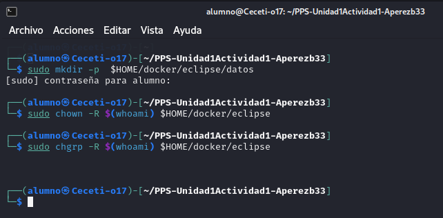
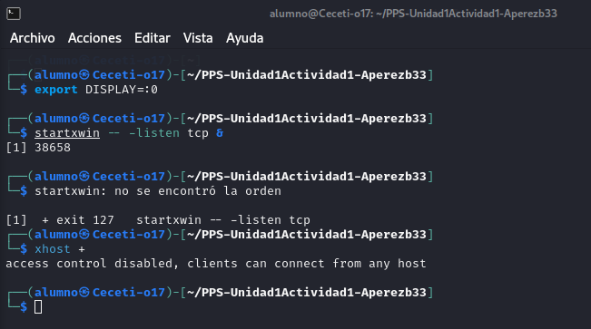
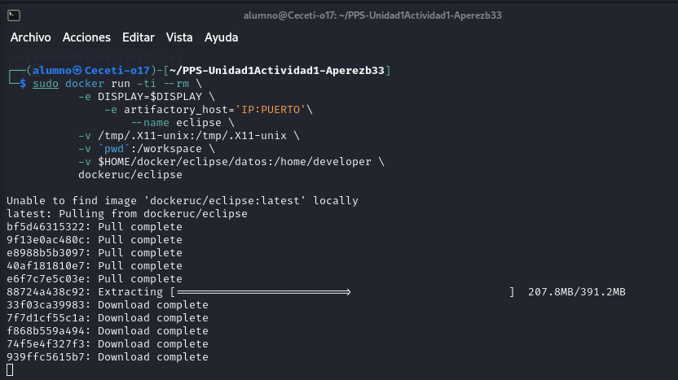
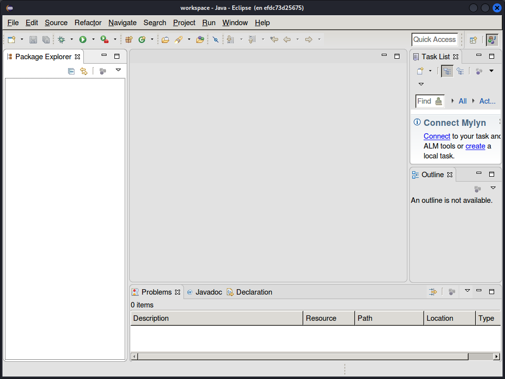
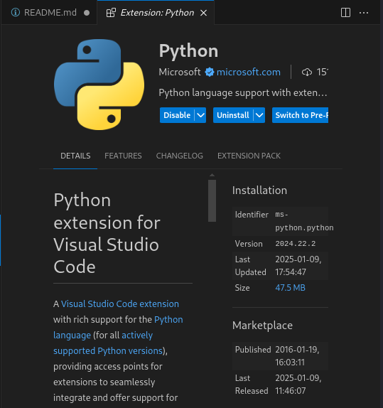
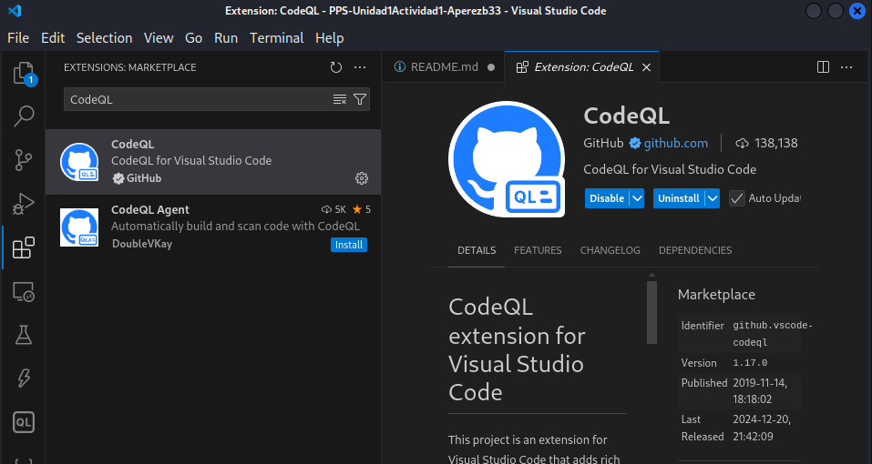
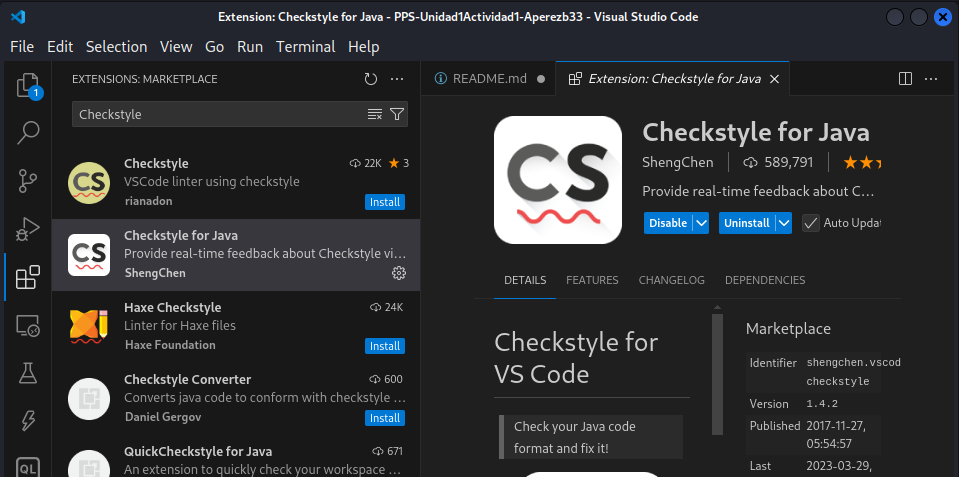
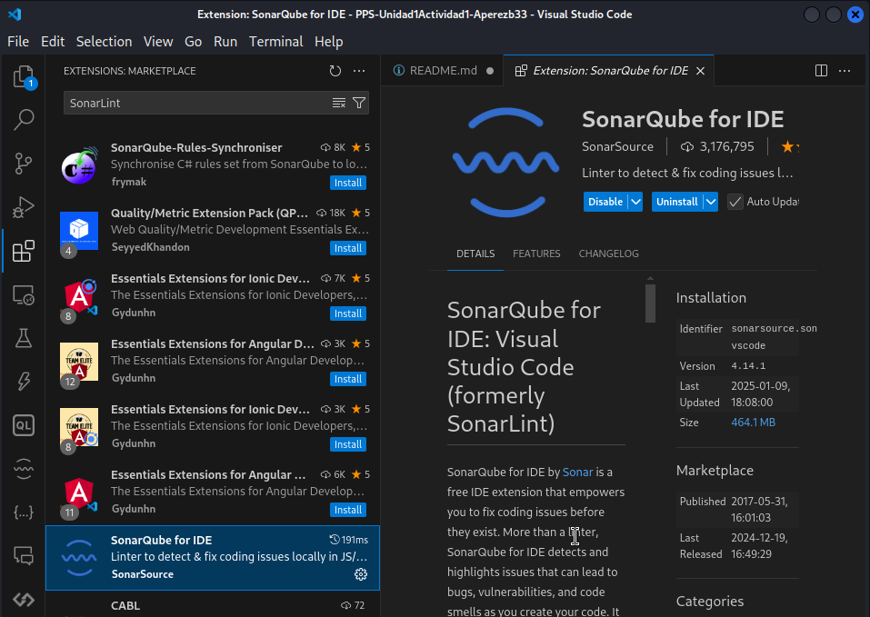

# PPS-Unidad1Actividad1-Aperezb33

Actividad 1 de la Unidad 1 de Puesta en Producción Segura.

Vamos a trabajar con Entornos de Desarrollo.

Objetivos:
* [Crear un entorno de desarrollo Eclipse con docker]()
* [Instalar extensiones en un IDE]()
* [Probar los entornos de Desarrollo]()

___

## Eclipse Docker

En el siguiente [enlace](https://hub.docker.com/r/dockeruc/eclipse) podemos encontrar informacion para crear un contenedor docker con un entorno IDE Eclipse.

Hay que fijarse bien en las instrucciones ya que vamos a trabajar con un entorno Linux:

1. Creamos las carpetas necesarias:
   

2. Configurar el entorno gráfico:

3. Lanzamos el contenedor:
   

Comprobación:

Explicación del comando:

El comando inicia un contenedor Docker con Eclipse, permite ejecutar la interfaz gráfica en mi máquina local, además, configura variables de entorno, monta directorios para compartir archivos y datos entre mi sistema y el contenedor y elimina el contenedor al terminar.

## Instalar extensiones

Las extensiones de un IDE facilitan el trabajo al programar, hace más flexible nuestro IDE y también hace que nuestro código sea más seguro. 

Las siguientes operaciones las puedes hacer desde el entorno Eclipse que hemos creado o puedes utilizar el IDE que prefieras en tu equipo:

Una vez dentro de Eclipse, pulsamos Help -> Eclipse Marketplace

1. Busca cuáles son las mejores extensiones de eclipse para programadores y las añades desde la tienda de tu IDE:

- Python:
 
 

- CodeQL:
  
 

2. Busca y escribe para qué sirven estos plugins: Checkstyle, Sonar Lint. 

- Checkstyle: 

Es una herramietna que revisa el código Java con el objetivo de verificar que sigue las convenciones de estilo definidas, como la identación y el nombrado de variables.

 

- Sonar Lint:

Es un plugin que analiza código en tiempo real para detectar errores, vulnerabilidades y problemas de calidad mientras escribimos código, ayuda de esta manera a mantener un código limpio y sin fallos.

 

> Ángel Pérez Blanco
## Prueba entornos

